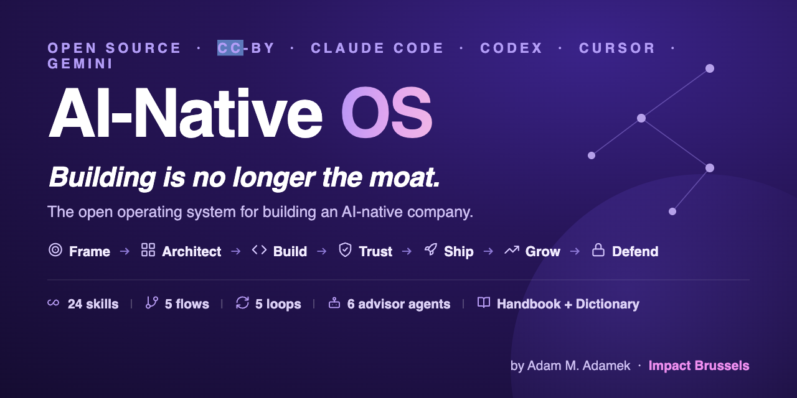

<div align="center">



# AI-Native OS

### The open operating system for building an AI-native company.

#### *Remove the AI and it should break.*

*Everyone can bolt a chatbot onto a product. Almost no one architects a company where intelligence
is the core, where every interaction makes the system smarter and the thing falls apart without it.
AI-Native OS is the whole method, open and runnable: a 15-chapter Handbook, a 90-entry Dictionary,
and 24 AI skills that take you from a vague idea to a company with a real data moat.*

[Handbook](#the-handbook) · [Dictionary](#the-dictionary) · [Skills](#the-skills) ·
[Install](#install) · [Non-coders start here](#not-a-coder) · [Contribute](#contribute)

     

</div>

---

## Why this exists

For 25 years I worked in food and biotech R&D, the kind of science where a confident guess that
skips the evidence costs millions. When I started building companies, I watched a new mistake replace
the old one: founders shipping an LLM call wrapped in a UI and calling it an "AI startup." It demos
beautifully. Then a competitor ships the same wrapper in a weekend, because there was never a moat,
just an API key.

The companies that last are built the other way around. Intelligence sits at the **core**: the
product is a closed loop that gets smarter with every use, the org runs on agents instead of
headcount, and the data it accrues can't be copied. That is an **AI-native** company, and almost
nobody teaches how to build one, least of all in the hard-mode sectors (food, health, deeptech)
where the regulation is real and the demos can kill someone.

So I built the operating system I wish I'd had. **AI-Native OS** turns "I want to build with AI" into
a sequence of clear, architecture-first steps: frame the bet, design the cognitive system before you
touch code, build with agents, earn trust in sensitive domains, ship a Minimum Viable Agent, grow via
GEO, and defend the moat. It is **theme-agnostic** on purpose (you supply the domain, it supplies
the method) and **open**, because the AI-native playbook should not be a $5k course.

- *Adam M. Adamek, PhD · [Impact Brussels ASBL](https://impact.brussels) · building in the open*
  Read the [MANIFESTO](MANIFESTO.md) · meet the author and [why I write](AUTHOR.md).

> **The one test this whole repo is built around, the Remove-the-AI test:** take the AI out of your
> product. If it still works, you built an AI feature, not an AI-native company. Everything here pushes
> toward systems that break without their intelligence, because that is where the moat is.

## The build arc

AI-Native OS is organised the way an AI-native company actually gets built:

```
 Frame  →  Architect  →  Build  →  Trust  →  Ship  →  Grow  →  Defend
```

Not sure where you are? **Run `start-here`**: it asks a few questions, runs the Remove-the-AI test,
and routes you to the one skill to run next. Full map: [docs/STAGES.md](docs/STAGES.md).

## What's inside

AI-Native OS has three layers that reinforce each other:

| Layer | What it is | Where |
|-------|-----------|-------|
| **Handbook** | *Load-Bearing*, the 15-chapter method (00 plus 14), long-form, ~33,800 words, with named case studies (NotCo, Foodpairing, OpenEvidence, Nuritas, BeeWise, Impact Brussels…). | [`handbook/`](handbook/) |
| **Dictionary** | The AI-native vocabulary: 90 terms in 7 categories, each defined the way Matt Pocock defines them: precise, opinionated, with usage and what to avoid. | [`dictionary/`](dictionary/) |
| **Skills** | 24 skills, one founder job each, every one a one-stop shop with its own `references/` folder. Runnable on Claude Code / Codex / Cursor / Gemini, or copy-pasted into any chatbot. | [`skills/`](skills/) |

Plus **5 flows** (multi-step workflows with checkpoints), **5 scheduled loops** with a
loop-engineering subsystem ([`docs/LOOP-ENGINEERING.md`](docs/LOOP-ENGINEERING.md) and the
[`design-a-loop`](skills/design-a-loop/SKILL.md) skill), **6 advisor agents** (a structured devil's
advocate, a safety judge, a clinical reviewer, a regulatory proxy, and more), **25 copy-paste
prompts** ([`prompts/`](prompts/README.md)), **masterfiles** (drop-in system context), and a living
**knowledge base**.

## The Handbook

The method, in depth: 15 chapters (00 plus 14), ~33,800 words. The handbook is titled
**"Load-Bearing"** (full title: *Load-Bearing: Building AI-Native Companies in Hard-Mode Sectors*);
the repo and OS itself stay **AI-Native OS**. Each chapter opens with the problem, gives you the core
concepts, shows 2–3 real companies that did it, and ends with the exact AI workflows (which tool,
which prompt) plus a "Your turn" exercise. Read it start to finish, or jump to your stage.

| # | Chapter | Stage |
|---|---------|-------|
| 00. | [What "AI-native" actually means](handbook/00-introduction.md) | (all) |
| 01. | The AI-native founder in hard-mode sectors | Frame |
| 02. | From vague idea to testable hypothesis | Frame |
| 03. | Mapping markets, competitors & EU terrain | Frame |
| 04. | Customer discovery that doesn't lie to you | Frame |
| 05. | Architecting your system before you touch code | Architect |
| 06. | Agentic coding in practice (Claude Code, Codex, Cursor, Gemini) | Build |
| 07. | Managing agentic technical debt before it kills you | Build |
| 08. | Evaluation & safety for multi-agent systems | Trust |
| 09. | Designing AI-native MVP experiments, not features | Ship |
| 10. | Narrative, positioning & founder brand (GEO) | Grow |
| 11. | AI-assisted sales, pilots & enterprise motions | Grow |
| 12. | Measuring real product-market fit, not AI hype | Grow |
| 13. | AI-native ops: automating the boring stuff | Defend |
| 14. | Moats, data & ecosystems | Defend |

## The Dictionary

You can't build what you can't name. The [Dictionary](dictionary/) defines the 90 words an AI-native
founder lives in (`context window`, `agent`, `MCP`, `hallucination`, `CACE`, `GEO`, `Share of
Model`, `Minimum Viable Agent`, `human-on-the-loop`, `data flywheel`), across 7 categories, each with
a one-line definition, the mechanics, what to *avoid*, and a real usage example. The Handbook and the
skills link into it, so the vocabulary is one coherent graph rather than scattered jargon.

## The skills

All 24 skills are shipped. Each is one job, produces a real artefact, carries its own `references/`
folder so it is a one-stop shop, and ends with a copy-paste prompt for non-coders.

| Stage | Skills |
|-------|--------|
| **Frame** | `frame-the-hypothesis` · `map-the-terrain` · `customer-discovery-that-doesnt-lie` · `hypothesis-mining` |
| **Architect** | `architect-before-code` · `cognitive-architecture-review` |
| **Build** | `agentic-build-loop` · `pay-down-agentic-debt` · `write-the-claude-md` · `self-healing-fallbacks` |
| **Trust** | `eval-and-safety-harness` · `red-team-the-agent` · `compliance-readiness` |
| **Ship** | `design-the-mva` |
| **Grow** | `measure-ai-native-pmf` · `geo-content` · `share-of-model-audit` · `ai-assisted-sales` |
| **Defend** | `gateway-agent-ops` · `moat-strategy` |
| **Cross-cutting** | `start-here` · `capture-learning` · `apply-ai-native-models` · `design-a-loop` |

Plus **5 flows** (`idea-to-mva-flow`, `ship-with-confidence-flow`, `architecture-first-flow`,
`geo-launch-flow`, `fundraise-the-ai-native-way-flow`), **5 scheduled loops** (`daily-agent-standup`,
`ci-failure-triage`, `weekly-share-of-model-review`, `weekly-debt-and-eval-review`, `red-team-cadence`)
with a loop-engineering subsystem, and **6 advisor agents** (`devils-advocate`, `safety-judge`,
`clinical-reviewer`, `regulatory-proxy`, `data-flywheel-architect`, `customer-proxy`). What's next is
in [ROADMAP.md](ROADMAP.md): a print-ready Handbook build, a worked sample company, more loops, and
translations, each a ready contribution slot.

## Install

**Claude Code**, clone into your skills path (or add as a plugin):
```bash
git clone https://github.com/impactbrussels/AINativeOS.git
cd AINativeOS
./install.sh
```
Then, in Claude Code: *"Use start-here. I want to build an AI-native company."* The installer wires
the skills into your tool; the full walkthrough, per platform, is in [INSTALL.md](INSTALL.md).

**Codex / Cursor / Gemini**: the same `skills/` source works. Codex reads [AGENTS.md](AGENTS.md),
Cursor reads [.cursor/rules/ai-native-os.mdc](.cursor/rules/ai-native-os.mdc), Gemini reads
[GEMINI.md](GEMINI.md). See the [cross-platform guide](docs/cross-platform-guide.md).

## Not a coder?

You do not need any developer tools. Every skill has a **copy-paste prompt** at the bottom, and the
[Prompt Library](prompts/README.md) collects all 25 as standalone files. Pick your stage, copy the
block, paste it into Claude.ai / ChatGPT / Gemini (or into a no-code builder like **Lovable, Bolt,
v0, or Replit**), fill the `[PLACEHOLDERS]`, and iterate. New to all of this? Start with the no-code
guide: [docs/FOR-NON-TECHNICAL-FOUNDERS.md](docs/FOR-NON-TECHNICAL-FOUNDERS.md).

## Contribute

AI-Native OS is built to be built *with* you. The [roadmap](ROADMAP.md) lists the planned skills,
flows, loops, and dictionary entries. Copy the gold-standard [`architect-before-code`](skills/architect-before-code/)
skill, follow [CONTRIBUTING.md](CONTRIBUTING.md), and open a PR.

## License & attribution

Dual-licensed so credit is **legally required**:
- **Content** (handbook, dictionary, skills, prompts, docs): [CC-BY-4.0](LICENSE-CONTENT).
- **Code** (scripts, workflows): [Apache-2.0](LICENSE-CODE).

Attribution: **AI-Native OS by Adam M. Adamek (Impact Brussels ASBL)**. Details:
[ATTRIBUTION.md](ATTRIBUTION.md). Citing in research? See [CITATION.cff](CITATION.cff).

**Credits and related work:** the thinkers, tools, and prior art this OS builds on are acknowledged in
[CREDITS.md](CREDITS.md).

<div align="center">

**AI-Native OS** · made for founders, by a founder · [Impact Brussels ASBL](https://impact.brussels)

</div>
