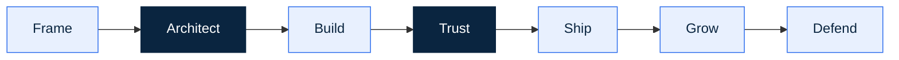

# 00. What "AI-Native" Actually Means

> **Thesis.** Remove the AI from your product. If it still runs, you built a feature, not a company. Defensibility has moved off the code and onto the two things code cannot copy: proprietary data and earned trust. This book is about building on the right side of that line.

## The shift

For thirty years the hard part of building a company was the building. Writing the code. Drafting the dossier. Standing up the infrastructure, hiring the people who could. That work was slow and expensive, so whoever could do it held the advantage, and the advantage was real.

It is gone. A founder with a frontier model and a few good tools now produces in an afternoon what used to take a team a month, and the cost keeps falling every quarter. When everyone can build, building stops being the edge. This is not a prediction. It is already true, and your competitors already know it.

Watch what that does to a wrapper, a thin interface over one model call. Everything good about it sits inside a model your competitor rents at the same price, on the same Tuesday. The prompt, the layout, the onboarding: a motivated stranger redoes all of it over a weekend, because your demo showed them exactly what to copy. The wrapper has nothing to defend. It owns nothing the next team cannot also buy by the token.

So the moat moved. It is no longer in the building, because the building is cheap. It is in the one thing a competitor cannot rent: the data your product accumulates that no one else holds, and the trust a buyer extends only after you have earned it the slow way. That is what "AI-native" means. Not "uses AI." Built so that the intelligence is **load-bearing**, and built so that what the intelligence compounds belongs to you.

## The Remove-the-AI test

One test sorts the company from the feature, and it runs in your head in ten seconds.

> **Remove the AI from your product. If it still works, you built an AI feature, not an AI-native company.**

Delete the model call. Look at what is left standing, then look harder at what just fell over. The moat lives in what breaks. Three products make it concrete:

- **A note-taking app adds an "AI summarise" button.** Take the AI out and you still have a perfectly good note-taking app. The summary was a feature. Nothing structural broke. A wrapper with a useful extra, and there is nothing wrong with that, as long as you know it.
- **A diagnostic tool learns from every food-safety lab result its network uploads, and flags contamination patterns no single lab could see alone.** Take the AI out and you have a folder of PDFs and no product at all. The intelligence was the product, and it got sharper with every upload. Native.
- **A "chat with your documents" tool, for any documents.** Take the AI out and you have an empty search box. But anyone can build it, because the documents are not yours and the model is not yours. Native to the technology, no moat, because nothing accumulates to you specifically.

That third case is the one founders miss, and it is the expensive one. "Breaks without the AI" is necessary. It is not sufficient. The full test has two halves: does it break without the intelligence, and does what breaks **belong to you**? Proprietary, accumulating, out of a horizontal giant's reach. A real AI-native company answers yes to both. So do not stop at "yes, it breaks." Push to the sharper question: when the AI is gone, what exactly falls over, and is that broken thing made of something I own? That sentence is the most important one in your business. You will write your version of it before you leave this chapter.

## AI-native versus wrapper

Say it plainly. In an AI-native company the intelligence is structural; pull it out and the building comes down. In a wrapper the intelligence is decorative; pull it out and you have a slightly emptier app that still runs.

The whole difference is one mechanism. A native system **compounds with use**. Every customer leaves something behind, a correction, a labelled outcome, an edge case the generic model fumbled, and the next customer's result is better for it. Use produces proprietary data. Proprietary data sharpens the product. A sharper product pulls in more use. That circle is the **data flywheel**, and it is the engine of every company in this book. A wrapper has no flywheel. It is the same on day 1,000 as on day one, because nothing it touches sticks.

OpenEvidence is the clean illustration. Doctors trust it not because its model is special, it rents the same models as everyone, but because the system is built so that what it accumulates and grounds against is the defensible part. *(Figures: see [SOURCES](SOURCES.md), `[claimed in source]`.)* Take the accumulation out and the trust goes with it.

This is also why the two look identical in a demo and split apart by week three. A demo is a single frame: one input, one output, no history. A native product is built to get better between frames. A wrapper is not. The gap that is invisible on Monday is the whole story by the end of the month.

| Dimension | AI-wrapper | AI-native |
| --- | --- | --- |
| Intelligence is | rented, generic | structural, partly yours |
| Remove the AI and | the app still mostly works | the company stops existing |
| Better with use? | no, same on day 1,000 | yes, the flywheel compounds |
| The moat | none you own | proprietary data, earned trust |
| Cloneable in a weekend? | yes | no |
| Looks like the other in a demo? | yes | yes, and that is the trap |

A wrapper is a fine place to start and a fatal place to stay. Almost every version one is a wrapper. The only question that matters is whether you designed the way off it before the cloners showed up.

## Why hard mode is the good mode

Food. Health. Deeptech. Hardware. Anything that touches regulation, physical safety, or a regulator's signature. On paper these are the worst places to build with AI, and most founders steer around them for exactly that reason. They are wrong, and their being wrong is your opening.

Hard mode is harder, and the difficulty is not cosmetic. The regulation is real: Novel Foods dossiers, EFSA opinions, clinical claims, CE marking. The mistakes are expensive in ways a screenshot never is: a hallucinated allergen or dose is a recall or a hospital visit. And the data you need is locked away, behind lab walls and inside regulatory filings, not sitting on the open web the models trained on.

Now turn each barrier over, because each one is also a wall that works in both directions. Real regulation means a generic model cannot legally or safely do your job out of the box. Mistakes that hurt people mean trust is not a nice-to-have; it is the product, and it is earned slowly and cannot be cloned. Locked-away data is the whole prize: the foundation models are brilliant on what is public and blind to what is not. The proprietary lab results, the failed batches, the regulator correspondence, the field outcomes, the giants cannot reach any of it, and you can.

That is the trade. Easy mode: cheap to enter, everyone enters, the moat is a puddle. Hard mode: expensive to enter, few enter, the moat is deep. The wall that keeps you out is the wall that, once you are inside, keeps everyone else out. The giants will own "summarise anything." They will not own "is this fermentation batch safe to ship under EU Novel Foods rules, given these nine thousand prior batches and this regulator's last three opinions." That one is yours, if you build for it.

## From "how" to "what should exist"

When building costs nothing, the scarce input is not execution. It is **judgement**. Knowing what should exist and what must never ship. Which problem is worth solving. Which corner can never be cut. Which regulator's objection will sink you, and which impressive feature is quietly a liability. A model will build the wrong thing fluently and confidently, and it will look excellent in the demo. Deciding it is the wrong thing is the one job no model does for you.

So the founder's role changes shape. You are the **conductor**. A conductor plays nothing. The conductor chooses the score, holds the standard, hears the one section that is flat, and stops the performance when it is wrong. Your agents are the orchestra: fast, tireless, capable, and useless without someone whose judgement points them at the right music. A cheap orchestra does not make the conductor optional. It makes the conductor the only scarce part of the whole arrangement. If you are a domain expert who never learned to code, read that twice. The thing you assumed was going obsolete is now the most valuable input you own.

## How to read this book

The repo is one thing in three layers, meant to be used together.

- **The Handbook**, the method. Long-form chapters, of which this is the first. It carries the thinking: the decisions, the trade-offs, the judgement. Read it in order the first time through.
- **The [Dictionary](../dictionary/README.md)**, the vocabulary. You cannot conduct an orchestra in words you do not share. It defines the language an AI-native founder lives in, each entry read in a minute, and every linked term in the Handbook points to it.
- **The skills**, the runnable part. Procedures your AI tools execute, so the method is not only read, it is done. That is what makes this an operating system and not a PDF.

All three sit on one build arc, the spine of the repo:

**Frame** the bet and run the Remove-the-AI test. **Architect** so the intelligence is load-bearing and the data compounds toward you. **Build** the smallest version that proves it. **Trust**: engineer against hallucination and earn what hard mode demands. **Ship** before the gap between demo and reality swallows you. **Grow** the flywheel and pull your headcount loose from your revenue. **Defend** the moat the giants cannot reach. Architect and Trust carry the most weight in hard mode, which is why they sit darker on the diagram.

You do not need to memorise the arc. You need to know it is there, so you always know roughly where you stand. Lost on day one? Run `start-here`: a few questions, then a pointer to the right chapter and the next skill. Non-technical founders especially, begin there.

## The test

Take the idea you would pitch tomorrow. Run the Remove-the-AI test on it now, and write one sentence in this exact shape:

> *When I remove the AI, **\_\_\_** breaks, and that broken thing is made of **\_\_\_**, which a competitor cannot easily copy because **\_\_\_**.*

Fill all three blanks with something true and specific and you are holding the seed of an AI-native company. If the first blank comes out "nothing, really," or the third comes out "honestly, they could," good. You learned it today, for free, instead of in week three with a round already raised. Write the sentence where you will see it. We come back to it in every chapter that follows. → Run `start-here`.

---

*Introduction to [Load-Bearing: Building AI-Native Companies in Hard-Mode Sectors](README.md). AI-Native OS by Adam M. Adamek (Impact Brussels ASBL). CC-BY-4.0. Next: [01. The AI-Native Founder in Hard-Mode Sectors](01-ai-native-founder.md).*
