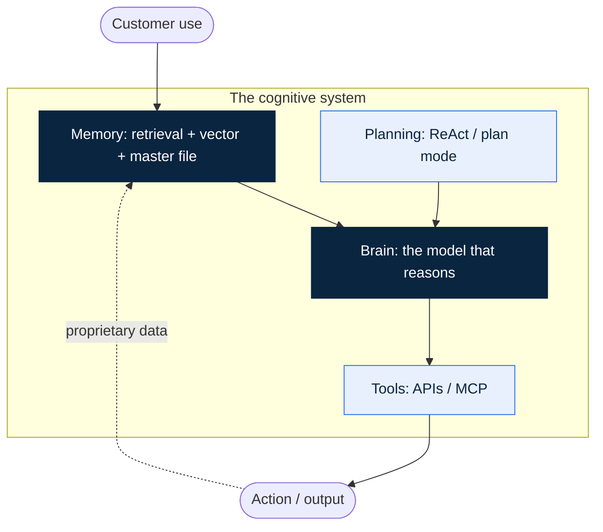

# 05. Architect Before You Touch Code

> **Thesis.** Write the system down before you generate it. Load-bearing intelligence is designed in, never bolted on: four pillars and one closed loop, fixed on paper before an agent touches the repo. Skip this and you do not get a faster company. You get a faster mess, one that nobody, not even the model, can reason about.

## The shift

AI made prototyping nearly free, and that is the trap. You describe a feature, a working version appears, and the appearing is so easy that you stop deciding things. One more endpoint. One more agent. All generated, none designed. It demos well. Then it grows, and it buckles, because there was never a structure underneath built to carry the weight.

Cheap code did not abolish the cost of bad architecture. It moved it downstream, where it is more expensive. When a human wrote every line by hand, the design got thought about, because slowness forced the thinking. An agent writes a thousand lines a minute and thinks about none of it. It fills whatever shape you handed it. Hand it nothing and it invents a shape, freshly, every session, a little different each time. Six weeks later you are running a system no human holds in their head and no model holds across two conversations.

Why does the shape drift? Because the agent is stateless. It remembers nothing between sessions and little across a long one. Each time it opens your repository it reconstructs, from whatever it can see, a theory of how your system fits together, and then it builds against that theory. Give it a written architecture and the theory is yours: stable, the same on Monday as on Friday. Give it nothing and the theory is improvised, plausible, and slightly different every time. That is how a single repository ends up housing three half-systems that almost agree.

The remedy is older than AI and matters more because of it. Whatever your title says, you are the lead systems engineer now. You fix the shape of the system, you write it down, and the agents fill it in afterwards. Architecture first. Code second. That order is the whole chapter.

## The framework

Five decisions separate a system that compounds from a prototype that rots.

1. **Architecture first.** Name every moving part before you generate one of them: each model, each prompt layer, each tool, each data store, each outside dependency, in a single document. An agent that can see the whole system stops hallucinating a parallel one into existence. The document is not paperwork. It is the contract the build is measured against, and the thing you hand each new session so it starts where the last one stopped instead of guessing.

2. **The four pillars.** Strip any AI-native system to its frame and you find four parts. The **Brain** reasons; it is the model, and you rent it at the same price as your competitor. The **Memory** is everything the system knows that the Brain does not: your retrieval layer, your vector store, your persistent master file. **Planning** is how it works out what to do, in order, before it acts. **Tools** are how it reaches into the world, through APIs and MCP, every call with a blast radius you should be able to name out loud. Name all four for your product and you have a system. Leave one to chance and you have a demo that holds right up until it doesn't.

3. **Design the closed loop first.** One line in your architecture outweighs the rest: the line where a customer's use today makes the product measurably better next month. That line is your flywheel. It is also the precise thing that falls over when someone runs the Remove-the-AI test on you. No loop, no flywheel, no moat. Most teams bolt this on last, which is the single clearest reason most teams have a wrapper. Put it in first. Everything downstream either feeds it or robs it, and you want to know which before you build a hundred features that quietly rob it.

4. **Persistent memory beats a clever prompt.** A clever prompt dies the instant the context window clears. A master file does not. Keep one in the repo, read at the top of every session, holding your principles, your trade-offs, and the constraints a newcomer would break by accident. Without it, each session reinvents your codebase from a blank page and gets it subtly, confidently wrong. With it, every session stands on the same ground you left it on. The prompt is a performance. The file is a memory.

5. **Treat data and recovery as the floor, not the trim.** Vector search is not a second-version nicety. Neither is the deterministic fallback that catches the model when it fails or quietly doubts itself. A system that cannot retrieve what it already knows, or cannot drop to a safe, boring path when the model goes wrong, is not a minimum viable product. It is a liability in a clean interface. Pour the floor first. You will lean on it harder than you planned to.

Here is the shape those pillars make. The dotted return path is the closed loop, and it is the one line that makes the product yours.

Read the diagram as a sentence. Customer use flows into Memory; Memory hands the Brain what it needs to reason; Planning sets the order of the moves; the Brain acts through Tools; and the output of that action, the proprietary data nobody else can generate, loops back into Memory. Four of those five arrows a competitor can copy by lunchtime. The dotted one they cannot, because it is made of your customers' use and your accumulated record, not of anything on a price list. When you fill the inventory in for your own product, put most of the effort into that single return arrow. It is the only part of the picture the market cannot sell you.

## Why it holds

Five companies, one pattern. The rented Brain is everyone's. The advantage lives in the Memory and the loop, and both are decisions made before a line of code.

**OpenEvidence** answers clinical questions in a way doctors will actually act on, and the reason is architectural, not magical. The Brain is a model anyone can rent. What earns the trust is the Memory pillar: a retrieval layer that ties every answer to a real entry in the medical literature, so the system cites rather than improvises. Pull the grounding out and you have a confident chatbot no clinician would let near a patient. The architecture is what makes the trust possible, and in medicine the trust is the entire product. *(Valuation and physician-reach figures: see [SOURCES](SOURCES.md), `[claimed in source]`.)*

**NotCo** built its R&D as a loop. A generative system proposes plant-based ways to rebuild an animal product from molecular and sensory data; every formulation and every taste test feeds back and sharpens the next proposal. The model is not the moat. The loop is. Each turn makes the proprietary dataset richer and a clone harder to attempt. That is a flywheel that was drawn on the architecture diagram, not stumbled into after launch.

**Nuritas** turned peptide discovery into a search problem and then fenced off the search. AI and genomics predict which molecules hidden in food might do something useful; the lab validates; the validated results feed the model that picks what to test next. The defensible asset is not the algorithm. It is the proprietary, validated dataset the loop keeps producing, which a competitor renting the same models cannot reproduce without running the same years of experiments. *(Discovery figures: see [SOURCES](SOURCES.md).)*

**Recursion** runs the same idea at industrial scale: automated lab cycles generate proprietary biology, the biology trains the models, the models choose the next round. Strip the company to its parts and the moat is the data the loop has already produced. Anyone can license the Brain. Nobody can re-run the history. *(Figures and current leadership: see [SOURCES](SOURCES.md).)*

**Foodpairing** shows the Memory pillar standing on its own, without a fast loop to flatter it. It turned flavour matching into data: gas chromatography profiles each ingredient into its aroma molecules, and likely pairings fall out of the compounds two ingredients share. The matching logic is ordinary. The proprietary database, built molecule by molecule over years, is not. A rival can rent an identical Brain and still face the same years of laboratory profiling before it can answer the question Foodpairing already answers. That asset was an architectural choice made early: build where a rival cannot follow, and rent the rest.

The rule under all five is that one, and you can apply it before you write a line. Store the proprietary thing; rent the replicable one. The Brain is replicable, so do not try to win there. The loop and the Memory are proprietary, so build everything there. Founders invert this constantly, pouring months into a clever prompt wrapped around a rented model and an afternoon into the data layer that was the actual moat. The architecture document is where you catch the inversion, because it forces you to point at the one asset a competitor cannot buy.

## In hard mode

Two pillars carry extra weight in food, health, and deeptech, and neither one retrofits.

Provenance lives inside Memory. A regulator will eventually ask what the system knew and when, and "we are not sure, the model just said it" is not an answer that keeps your product on the market. Versioned data and an immutable record belong in the architecture at the first commit. Add them after an incident and you are re-platforming against a deadline, with a regulator watching. Build the record as you go, not as you later recall it. A log assembled after the fact is the evidence an auditor trusts least, and they are right to.

The deterministic fallback lives inside Planning. When confidence drops, or the question touches a dose, an allergen, or a safety threshold, the system has to fall to a fixed, non-AI path instead of guessing fluently. A hallucination in a meme app is a screenshot. The same hallucination on a label or a chart is a recall. That fallback is an architectural decision, and it costs almost nothing on day one and a fortune on day four hundred. Decide the threshold now, while it is a design choice rather than an incident report. The question is never whether the model will fail. It is whether your system already knows what to do on the day it does.

Here is the part founders miss. The architecture that satisfies the regulator is the same architecture that builds the moat in chapter 14. Versioned, audited, proprietary, hard to reach. You are not paying a compliance tax. You are pouring the foundation of the only durable advantage you will have.

## What it means for you

1. **Write the System Inventory before you generate code.** Name the Brain, the Memory, the Planning, the Tools, and the one closed loop. Use [`masterfiles/SYSTEM-INVENTORY-TEMPLATE.md`](../masterfiles/SYSTEM-INVENTORY-TEMPLATE.md). It takes an hour. It saves a re-platform.
2. **Write the master file first, code second.** Put `CLAUDE.md` and its mirrors in the repo before the first feature, and add a line to it at the end of every session naming the trade-off you just made.
3. **Say your closed loop out loud, in one sentence.** If you cannot, you have not designed a flywheel yet. You have a feature with ambitions. Design the loop today, not after launch.
4. **Decide the fallbacks before the features.** List the answers that must never be wrong, and write the boring, deterministic route for each one.
5. **Then let the agents build.** Generate against the inventory, never against a blank page. The structure you wrote is the score. The agents are the orchestra. You already know who the conductor is.

## The test

Open your architecture doc. If you cannot point to the one loop where customer use makes the product measurably better next month, you do not have a moat. You have a wrapper with good intentions. Fix the architecture before you write another line. → Run `architect-before-code`.

---

*Chapter 05 of [Load-Bearing](README.md). AI-Native OS by Adam M. Adamek (Impact Brussels ASBL). CC-BY-4.0. Prev: [04. Customer Discovery That Doesn't Lie](04-customer-discovery.md) · Next: [06. Agentic Coding in Practice](06-agentic-coding-in-practice.md).*
