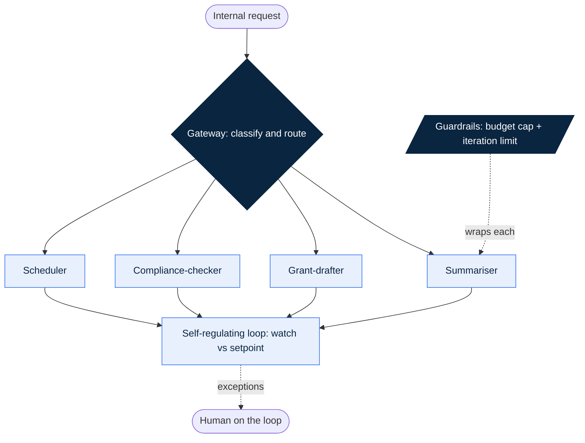

# 13. AI-Native Ops: Automating the Boring Stuff

> **Thesis.** Make the company legible to AI, then point it at the work that drains you. A gateway routes each request to a narrow specialist, self-regulating loops run the boring tail without a babysitter, and guardrails stop a runaway agent before it bills you. Build it this way and a tiny team operates like a much larger one. Nonprofits included.

## The shift

The work that makes a company special is not the work that runs it. The grant annex due in three weeks, the quarterly compliance sweep, the post nobody wants to write, the standup that eats forty-five minutes to surface two updates: this is the dark matter of an organisation. Heavy, invisible, pulling on everything. A traditional company hires people to absorb it. An AI-native company points agents at it and keeps its founders on the work only they can do.

Most founders then automate it wrong. They read that AI can run operations, get excited, and build one big assistant. Tell it to handle ops. For a week it is magic. Then it routes a refund through the marketing logic, books a board call for 3am, and gets stuck reconciling two records that cannot be reconciled, burning tokens all weekend while you sleep. Monday brings a four-figure bill and a system nobody trusts. So you rip it out and go back to doing it all by hand, which is the original trap wearing a different coat.

The mistake was never automating. The mistake was automating like you would hire one heroic generalist and say "you have got this." That is not how operations run and it is not how agents run. The companies that get this right do not build one big brain. They build a switchboard in front of a roster of small specialists, each watched, each capped, each easy to fix when it misbehaves. And before any of that works, they make the company readable: an agent can only act on what it can retrieve.

## The framework

Five decisions turn the boring tail from a tax into an asset.

1. **The queryable organisation.** An agent's quality is capped by the context you can feed it, and context you never captured cannot be fed. Record the meetings and keep the transcripts. Move work out of ephemeral one-to-one DMs into channels that persist and search. Embed agents where the work happens so context is captured as it is created, not reconstructed later. If a decision was made, there is a durable record of what and why, and an agent can find it. This is the org-level [memory system](../dictionary/02-context-and-sessions.md#memory-system): the model remembers nothing, so the statefulness of your company is something you build on purpose.

2. **The gateway agent.** Something has to decide who handles each incoming request. The wrong answer is one giant agent. The right answer is a thin [gateway agent](../dictionary/04-agentic-patterns.md#gateway-agent), a classifier that reads the request, works out what kind it is, dispatches it to the specialist built for that kind, and gets out of the way. It does one job: route. Behind it sits a roster of narrow specialists, a summariser, a grant-drafter, a compliance-checker, a scheduler, each with a short prompt and a small toolset. This is the deliberate opposite of [the God Agent](../dictionary/04-agentic-patterns.md#the-god-agent-anti-pattern), the bloated prompt doing many jobs that nobody can debug, extend, or trust. The gateway must stay dumb. The moment it carries domain logic, you have rebuilt the God Agent with an innocent name.

3. **Self-regulating loops.** A gateway that routes well still needs something watching whether the outcomes are good. Specialists drift. A summariser sharp last month starts missing the point; a compliance-checker tuned to one rule goes stale when the rule moves. A self-regulating loop is a feedback loop with a setpoint: you define what good looks like ("every reply answered within an hour," "every grant section passes the compliance check before a human sees it"), the loop measures outputs against it, notices drift, and corrects by re-routing, re-prompting, or escalating. Your job moves up a level, from doing the work to setting the goal the loop checks itself against. Human on the loop, not human in it.

4. **Infinite-loop guardrails.** An agent in a loop picks its next action from the current state. If the state never resolves the way it expects, a tool that keeps erroring, a goal subtly impossible, two agents handing a task back and forth, nothing in the agent gets tired and gives up. It tries again, and again, and each attempt costs a call. That is the four-figure weekend bill: a meter spinning while you sleep. The [infinite loop (runaway agent)](../dictionary/05-failure-modes.md#infinite-loop-runaway-agent) is stopped by circuit breakers, a hard iteration cap, a budget ceiling, a wall-clock timeout, loop detection that notices "I have tried this exact thing three times." These are the seatbelt, not the polish. Every specialist gets a budget cap and an iteration limit before it goes live. Full stop.

5. **Automating the boring tail.** Now aim all of it at the right target. The temptation is to automate the exciting, strategic work, which is backwards, because judgement in your domain is the one thing no agent has. What you hand off is the boring tail: grant applications, regulatory and quality compliance, content, status reporting, the repetitive knowledge work that is heavy but not hard. These tasks share a profile. Repetitive, so the specialist pays back many times. Knowledge-intensive, so they reward an agent that can read your whole queryable organisation. Bounded, a grant has a structure and a compliance check has a rulebook, so a narrow specialist does them well without general intelligence. Hand them off and the scarcest resource, founder attention, stays pointed at the things only founders can do.

These five stack. The queryable organisation is the floor every specialist reads from. The gateway is the front door. The loops keep quality up without a babysitter. The guardrails stop the meter. The boring tail is the target you point the whole machine at. Skip the floor and the specialists run blind. Skip the guardrails and one bad request bills you for the weekend. The order is the discipline.

## Why it holds

Three companies, one pattern: decompose the boring tail into narrow, checkable stations and the work gets done by a small team.

**Finery Markets**, a financial-infrastructure company, pointed agents at one of the most thankless jobs in finance, producing financial reports. The job is a chain: pull data from many sources, extract the figures, reconcile, summarise into readable prose. Rather than one agent to "make the report," they chained specialists, a data-extraction agent that pulls and structures the raw figures handing off to a summarisation agent that turns structured data into a draft. By the company's account this cut report production time by roughly 90% [claimed in source]. The transferable insight is not the percentage. It is the [agent pipeline](../dictionary/04-agentic-patterns.md#agent-pipeline): a task run through a fixed sequence of narrow stations, so when something comes out wrong you find the broken station instead of re-rolling the whole report. A monolith that hallucinates one figure makes you re-run the lot. A pipeline tells you the extraction stage misread one source, and you fix the station.

**Zapier** built AI agents that handle end-to-end operational work, scheduling and project management, from a single prompt. A user describes the outcome in plain language and the agent carries the task across multiple steps and tools to completion instead of the user clicking through each one. The lesson here is the interface to the boring tail. The breakthrough is not only that the work gets automated; it is that the trigger becomes a sentence. "Schedule the kickoff with the three leads next week and set up the project board" is now an instruction, not an afternoon. An automation that takes ten minutes to invoke gets abandoned under pressure. One that takes a sentence survives the busy week, the only week that matters. The discipline to copy is to make every boring-tail task you build invokable in one prompt, so the cost of triggering it stays near zero and you reach for the agent instead of reverting to the old afternoon by hand.

**Impact Brussels**, the small nonprofit behind AI-Native OS, runs as a deliberately AI-native organisation, and the nonprofit part matters, because it shows this is not only for venture-backed startups chasing scale. It is for any tiny, mission-driven team drowning in necessary work. The organisation runs teal and self-managing: authority sits with whoever is closest to the work, and the coordination a hierarchy would normally supply is carried instead by agent pipelines and a queryable shared memory. The boring tail, grant-writing support, compliance research, content, runs through specialist pipelines rather than a large staff. No metric is claimed here, by design. The point is the operating model: a small team operating above its headcount because the tail runs on agent networks, not hands. That is the [one-ten-hundred](../dictionary/07-ai-native-business.md#one-ten-hundred) idea, treated as a design target rather than a promise.

## In hard mode

In food, health, and deeptech the boring tail is exactly the work worth automating, and exactly the work where a runaway agent does real damage. Regulatory compliance, quality documentation, grant reporting: each is repetitive, knowledge-intensive, and bounded by a rulebook, which is the ideal profile for a specialist. Each is also the work a regulator audits.

So the rule that keeps the framework safe in hard mode is non-negotiable. A self-regulating loop earns autonomy on the boring, reversible work and hands the irreversible calls back to a person, every time. The compliance-checker drafts; a human approves before anything reaches the regulator. The grant-drafter assembles the annex; a human signs before submission. When the loop is uncertain, it does not guess fluently, it stops and surfaces. A hallucination in a status report is an awkward edit. The same hallucination on a label, a dossier, or a regulatory filing is a recall or a rejected application. The setpoint in a sensitive domain always includes a deterministic stop, and the human-on-the-loop point is fixed before the specialist goes live, not bolted on after the first close call.

There is a second reason hard-mode ops reward this design more than any other sector. The boring tail in regulated work is enormous. A Novel Food dossier, an EFSA submission, a quality-management file, a grant reporting cycle: each is months of repetitive assembly that a small team cannot staff and cannot skip. This is precisely the work a specialist roster carries, and precisely the work that, left to people, eats the founders alive. The sector that looks hardest to automate is the one with the most to automate.

This is also the same logic as the moat. The queryable, versioned, audited record that lets an agent run your compliance is the same record a regulator asks for and the same proprietary asset a competitor cannot reach. You are not paying a tax to be careful. You are pouring a foundation.

## What it means for you

1. **Make the company queryable first.** Record the meetings, move work into searchable channels, capture the decisions. An agent pointed at a company that runs on hallway chats and disappearing DMs is reading a book with the pages torn out. Capture the signal that changes the next decision; let the chatter go.
2. **Build the gateway, keep it dumb.** Stand up a router against two or three specialists, then add the rest one at a time. The router classifies and hands off and does nothing else. If you find yourself adding a business rule to the router, that rule belongs in a specialist.
3. **Wrap every specialist before it ships.** A hard iteration cap, a per-task budget ceiling, loop detection. No exceptions. An agent that can spend money in a loop without a ceiling is a liability you have not been billed for yet.
4. **Set the loop's setpoint, then read the exceptions.** Define what good looks like for each automated task and let the loop watch itself against it. In a sensitive domain, fix the human-on-the-loop point and the deterministic stop in the same breath.
5. **Aim at the quiet, high-frequency tax.** Rank candidate tasks by total time eaten, not by how annoying they feel. The most irritating task is rarely the most expensive. Build the specialist for the forty-minutes-a-day leak nobody complains about.

## The test

Name the single most repetitive operational task eating your week, the one that is necessary but not the work only you can do. Can you state its gateway routing rule in one breath: the trigger, the one-job specialist, its small toolset, its budget cap and iteration limit, and the point where a human signs before anything irreversible? If you cannot, you do not have an automation yet. You have a chore you have not decomposed. The `gateway-agent-ops` skill (Stage: Defend) is the runnable version, and it is on the [ROADMAP](../ROADMAP.md), not yet shipped. Until it lands, build the switchboard by hand using the loops pattern above, and after each real outcome run `capture-learning` to bank the dated, sourced lesson.

---

*Chapter 13 of [Load-Bearing](README.md). AI-Native OS by Adam M. Adamek (Impact Brussels ASBL). CC-BY-4.0. Prev: [12. Measuring Real Product-Market Fit](12-measuring-real-pmf.md) · Next: [14. Moats, Data & Ecosystems](14-moats-data-ecosystems.md).*
